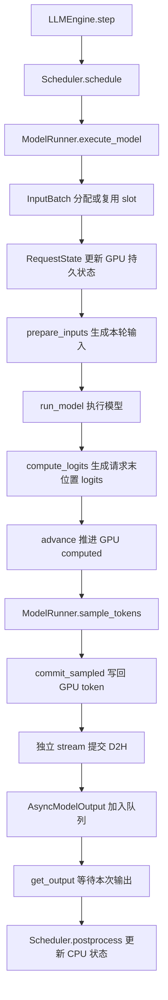
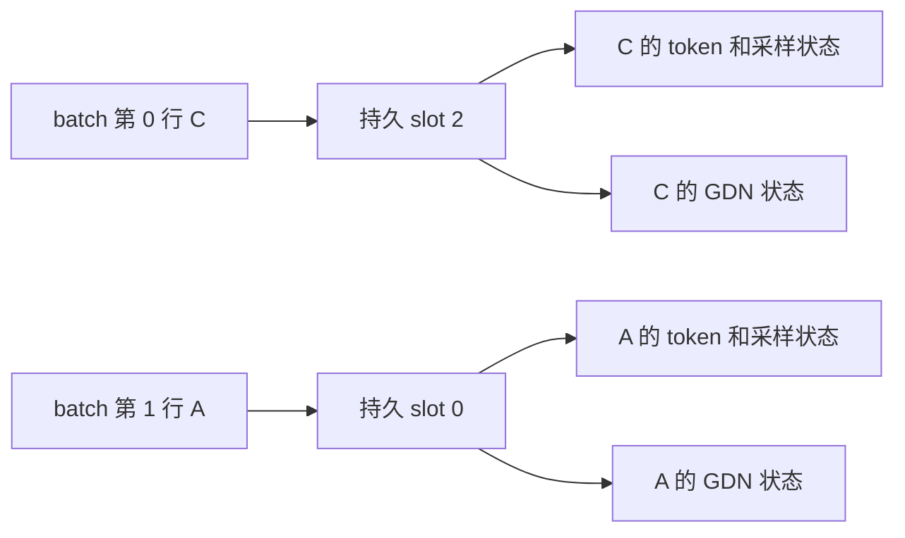
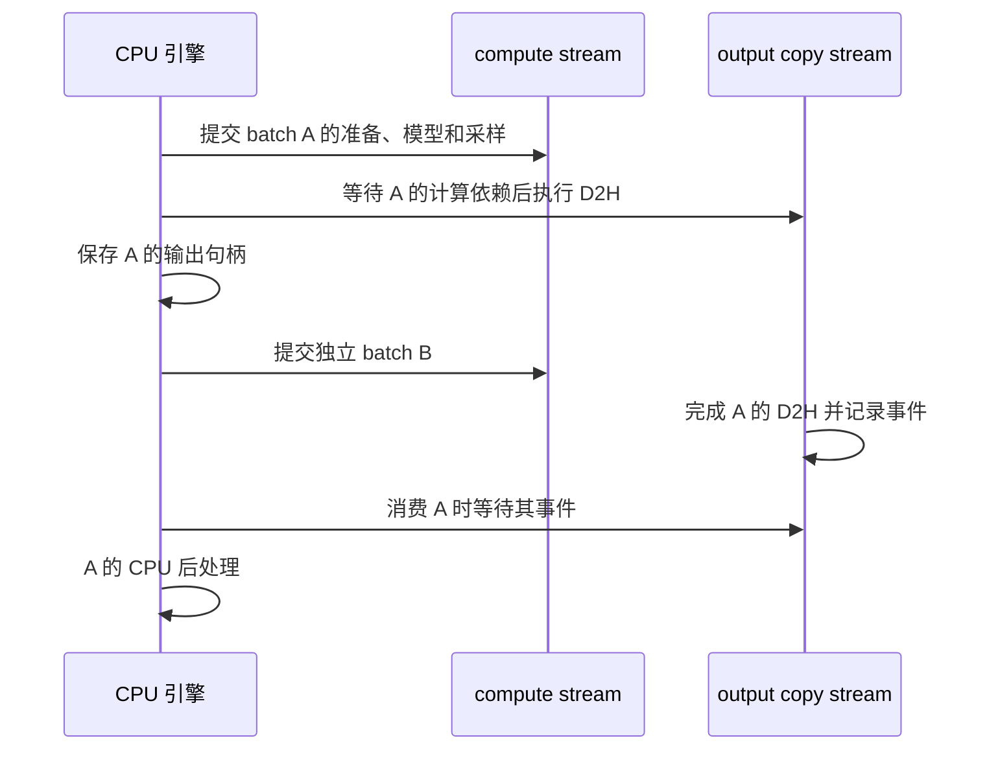

# MRV2 中文实现详解

本文解释 `hybridinfer` 当前的 Model Runner V2（简称 MRV2）实现。重点是请求状态如何保存、每轮输入如何生成、模型与采样如何衔接，以及异步执行为什么不会破坏请求状态。文中的类名、字段名和执行路径均对应本仓库代码。

**当前项目已经实现 MRV2 的核心执行机制，但尚未与 vLLM MRV2 的完整功能对齐。** 支持范围是现有的 Qwen3.5 文本推理路径；同一请求的乐观异步调度、推测解码、多模态、LoRA 等能力不在当前实现中。执行架构参考 [vLLM 官方 MRV2 设计文档](https://github.com/vllm-project/vllm/blob/main/docs/design/model_runner_v2.md)，下文对本项目细节的解释以本地代码为准。

建议先阅读第 1～4 节建立整体认识，再通过第 5～8 节跟踪一次实际执行。第 9～13 节解释调度、CUDA Graph、TP 和状态回收；最后几节列出验证方法与实现边界。

## 目录

- [1. MRV2 解决什么问题](#overview)
- [2. 从哪些文件开始读](#code-map)
- [3. 三种索引：请求 slot、batch 行号、KV 写入位置](#indices)
- [4. CPU 与 GPU 分别保存什么](#state-ownership)
- [5. 请求加入与增量状态更新](#state-updates)
- [6. GPU 统一输入准备](#input-preparation)
- [7. 模型执行、长度推进与 token 提交](#execution)
- [8. Triton 采样器](#sampling)
- [9. 异步执行与输出内存安全](#async-output)
- [10. 调度器、队列与抢占恢复](#scheduling)
- [11. Qwen3.5 的 GDN 状态](#gdn)
- [12. CUDA Graph 管理](#cuda-graphs)
- [13. Tensor Parallel 请求与采样同步](#tensor-parallel)
- [14. 内存与性能取舍](#memory)
- [15. 测试、验证与使用](#validation)
- [16. 已实现的机制与剩余差距](#limitations)

<a id="overview"></a>

## 1. MRV2 解决什么问题

LLM 推理除了执行模型，还要持续处理请求加入、结束、抢占、batch 重排、KV 块分配、采样参数和输出拷贝。这些操作如果大量依赖 Python、反复上传大张量，或者频繁等待 GPU，会使计算与调度难以重叠。

MRV2 在本项目中的主要变化有三项：

1. 请求长期状态拥有稳定的存储位置，每轮执行顺序可以独立变化。
2. token、已计算长度、block table 和采样参数常驻 GPU，GPU 直接生成本轮输入。
3. CPU 提交计算与拷贝操作，消费输出时才等待对应结果。

vLLM V1 本身已经有持久 batch，也支持异步调度。MRV2 的关键变化是重新组织状态布局与异步执行，而不是首次引入这两项功能。可结合 [官方设计文档的 Persistent Batch 部分](https://github.com/vllm-project/vllm/blob/main/docs/design/model_runner_v2.md#1-persistent-batch)理解这一背景。

本仓库的执行变化可以直接对照代码：

| 环节           | 改造前的项目实现                                        | 当前实现                                              |
| -------------- | ------------------------------------------------------- | ----------------------------------------------------- |
| 请求身份       | 已有请求到 slot 的映射                                  | 保留固定 slot，并完善容量与生命周期管理               |
| token 输入     | decode 读取 GPU 上最后一次采样结果；prefill 在 CPU 拼装 | GPU 保存 token 历史，prefill、decode 共用输入准备内核 |
| block table    | 每轮在 CPU 构造完整二维表并上传                         | GPU 保存持久表，CPU 只提交变化，本轮在 GPU gather     |
| 已计算长度     | CPU 根据`Sequence` 构造 decode 元数据                 | GPU`computed` 直接参与输入准备并在执行后推进        |
| 采样参数       | 每轮收集温度并上传                                      | 请求加入时上传，采样内核通过 slot 读取                |
| 输入拷贝保护   | 等待上一轮输入准备事件                                  | 每次 H2D 使用独立且不再修改的 pinned 快照             |
| 随机采样       | PyTorch softmax 加指数噪声                              | 两阶段 Triton Gumbel-max                              |
| prefill logits | 对全部 token 做词表投影，再选择末位置                   | 先选择每个请求的末位置 hidden，再做词表投影           |
| CPU 输出存储   | 轮换使用两个固定缓冲区                                  | 每个输出句柄拥有独立缓冲区和完成事件                  |

<a id="code-map"></a>

## 2. 从哪些文件开始读

| 文件                                                            | 主要职责                                                   |
| --------------------------------------------------------------- | ---------------------------------------------------------- |
| [llm_engine.py](../src/hybridinfer/engine/llm_engine.py)           | 调用调度器、提交执行、维护输出队列、消费结果               |
| [scheduler.py](../src/hybridinfer/scheduler/scheduler.py)          | token 预算、请求准入、KV 容量检查、抢占和后处理            |
| [sequence.py](../src/hybridinfer/engine/sequence.py)               | CPU 上的请求身份、token 历史、生成参数与生命周期           |
| [request_state.py](../src/hybridinfer/engine/request_state.py)     | `InputBatch` 的固定 slot 管理，以及 GPU `RequestState` |
| [staged_write.py](../src/hybridinfer/engine/staged_write.py)       | 增量状态写入和不可变 H2D 快照                              |
| [input_prep.py](../src/hybridinfer/engine/input_prep.py)           | GPU 输入准备、已计算长度推进、采样结果提交                 |
| [model_runner.py](../src/hybridinfer/engine/model_runner.py)       | 组织请求状态更新、模型执行、采样与异步输出                 |
| [sampler.py](../src/hybridinfer/layers/sampler.py)                 | Triton 分块采样和全局归约                                  |
| [cuda_graph.py](../src/hybridinfer/engine/cuda_graph.py)           | decode 图与分段 prefill 图的捕获、重放、清理               |
| [context.py](../src/hybridinfer/utils/context.py)                  | 传递 attention、GDN 和图路由所需的本轮元数据               |
| [async_output.py](../src/hybridinfer/engine/async_output.py)       | 输出缓冲区、完成事件及 CPU 结果缓存                        |
| [gated_delta_net.py](../src/hybridinfer/layers/gated_delta_net.py) | 以请求 slot 为索引维护卷积和递归状态                       |

[decode_init.py](../src/hybridinfer/engine/decode_init.py)仍保留旧的 decode 输入准备内核，但当前 `ModelRunner` 主路径使用的是 `input_prep.py`，不能把旧文件当成现行执行入口。

整体调用关系如下：



这里表示调用与数据依赖关系。CPU 执行到 `run_model()` 返回，不代表 GPU 已完成模型计算；通常只是对应操作已经入队。

<a id="indices"></a>

## 3. 三种索引：请求 slot、batch 行号、KV 写入位置

这是理解实现时最需要区分的三个概念。

### 3.1 请求 slot：长期状态的地址

`InputBatch` 为活跃请求分配固定 slot，主要字段包括：

```python
seqs                 # slot -> Sequence
seq_id_to_slot       # seq_id -> slot
_free                # 可用 slot 的队列
```

例如，三个请求当前分别占用：

```text
slot 0 -> 请求 A
slot 1 -> 请求 B
slot 2 -> 请求 C
```

在请求结束或被抢占之前，这个位置不因 batch 重排而改变。重新准入的请求可以获得其他 slot；“固定”指一次驻留期间固定，并不是整个请求从创建到最终结束始终固定。

`InputBatch.update()` 会先检查 batch 内请求是否重复、空闲 slot 是否足够，再分配新请求的位置。这样容量不足时不会发生“先分配一部分，再中途失败”的情况。

### 3.2 batch 行号：本轮执行的排列

本轮可能只执行 C 和 A，并把 C 放在第一行：

```text
本轮请求顺序       [C, A]
batch 行号         [0, 1]
batch_slots_gpu    [2, 0]
```

`batch_slots_gpu[row]` 表示该 batch 行属于哪个持久 slot。因此，内核可以通过这个映射读取温度、seed、token 历史与已计算长度，而不必移动这些长期状态。



### 3.3 `slot_mapping`：写 KV cache 的物理位置

`slot_mapping` 中的 slot 与上面的请求 slot 含义不同。它描述的是**每个输入 token 在 KV cache 中的物理写入位置**。

设 token 的逻辑位置是 `position`，每个 KV 块容纳 `block_size` 个 token，则：

```text
逻辑块号      = position // block_size
块内偏移      = position % block_size
物理块号      = block_tables[request_slot, 逻辑块号]
KV 写入位置   = 物理块号 * block_size + 块内偏移
```

请求 slot 索引请求状态；`slot_mapping` 索引 KV 存储。两者不能互换。

<a id="state-ownership"></a>

## 4. CPU 与 GPU 分别保存什么

### 4.1 GPU `RequestState`

设：

```text
N = max_num_seqs
L = max_model_len
B = kvcache_block_size
M = ceil(L / B)
```

`RequestState` 包含以下持久张量，每个字段由 `StagedWriteTensor` 包装，实际 GPU 数据在其 `.tensor` 中：

| 字段             | 形状           | dtype   | 含义                                         |
| ---------------- | -------------- | ------- | -------------------------------------------- |
| `tokens`       | `[N, L + 1]` | int64   | prompt 与已生成 token 的历史                 |
| `block_tables` | `[N, M]`     | int32   | 逻辑 KV 块到物理块的映射，未使用位置为`-1` |
| `computed`     | `[N]`        | int32   | 每个请求已经参与模型 forward 的 token 数     |
| `temperatures` | `[N]`        | float32 | 每个请求的采样温度                           |
| `seeds`        | `[N]`        | int64   | 每个请求的随机 seed                          |

这里最容易误读的是 `computed`：它不是 token 历史的总长度，也不是已经生成的 token 数。

例如，prompt 有 5 个 token，prefill 已处理完并采样出一个新 token：

```text
GPU token 历史       [p0, p1, p2, p3, p4, sampled0]
computed             5
下一轮 forward 输入  tokens[5]，即 sampled0
```

新 token 虽然已经生成，但还未经过 forward，所以 `computed` 仍为 5。

`L + 1` 中额外的一格用于保存在最后一个允许的 forward 位置之后采样出的 token。当前终止条件保证不会继续执行越过 `L` 的 forward；它并不将 CPU token 列表长度强制限制为 `L`，因此达到长度边界时列表可能包含最后一个额外采样 token。

`sampled_token_ids_gpu` 是 Runner 保留的“每个请求最后一次有效采样 token”缓冲区。当前统一输入准备从 `RequestState.tokens` 读取 token，不再依赖这个缓冲区生成 decode 输入。

### 4.2 CPU `Sequence` 与调度状态

CPU 仍保存请求对象与控制信息：

- `Sequence.token_ids` 保存供输出、重放和 CPU 后处理使用的完整历史。
- `num_cached_tokens` 表示 CPU 已确认处理的 token 数。
- `num_scheduled_tokens` 表示本轮分配给请求的 forward token 数。
- `block_table` 记录 CPU KV 分配器分配的物理块。
- `is_prefill`、`status`、`max_tokens`、`ignore_eos` 等用于调度与终止判断。

GPU `computed` 在计算提交路径中推进，CPU `num_cached_tokens` 在消费输出后推进。两者可以暂时不同：

| 时刻                               | CPU`num_cached_tokens` | GPU`computed` 的目标值 |
| ---------------------------------- | ------------------------ | ------------------------ |
| 本轮提交之前                       | `c`                    | `c`                    |
| 本轮操作已经入队，CPU 尚未消费输出 | `c`                    | 入队执行后变为`c + q`  |
| CPU 消费输出并完成后处理           | `c + q`                | `c + q`                |

`q` 是本轮 `num_scheduled_tokens`。GPU 的值何时实际变化，由 compute stream 上的执行进度决定，不能仅凭 Python 函数返回时刻判断。

当前调度器禁止同一请求在上一轮输出未消费时再次提交，因此下一次真正调度该请求时，CPU 和 GPU 的长度状态已经重新对齐。

<a id="state-updates"></a>

## 5. 请求加入与增量状态更新

### 5.1 新请求或抢占后恢复

`execute_model()` 先调用 `InputBatch.update()`，得到新请求及对应 slot。随后 `RequestState.update()` 为新 slot 提交：

1. 完整 token 历史。
2. 当前 `num_cached_tokens`，作为 GPU `computed` 的起点。
3. 采样温度与 seed。
4. 初始化后的 block table。

显式 `SamplingParams.seed` 优先。没有指定时，当前代码使用：

```python
(torch.initial_seed() + seq.seq_id) % (2**63)
```

slot 重用时，block table 整行先写成 `-1`，再写入新请求的有效块，防止读取旧请求留下的映射。GDN 状态则由 Runner 对新 slot 调用各层的 `reset_state()`。

### 5.2 已驻留请求只提交变化

`RequestState._blocks` 在 CPU 保存上次 block table 的快照。它不是另一个用于模型执行的完整 GPU 状态副本，而是增量比较所需的记录。

例如，一个请求的 block table 从：

```text
旧表：[8, 12]
新表：[8, 12, 19]
```

变为三块时，只需要提交第 2 列的 `19`。如果已有列发生变化，代码会从第一个变化位置开始写入新表的后缀；如果表缩短，则将不再使用的旧后缀清为 `-1`。

因此，常规 decode 不会每轮上传完整 token 历史、温度、seed 或完整 block table。但本轮 slot 映射、token counts 等小型控制元数据仍会上传。

### 5.3 `StagedWriteTensor` 如何工作

`stage_write(row, start, values)` 将二维行内写入转换为扁平地址：

```text
flat_index = row * width + start + i
```

暂存写入使用 CPU 字典 `_writes`。同一提交中对同一地址多次写入，最后的值覆盖前面的值。例如，先把整行 block table 清空，再填有效块，不会产生多个 GPU 线程写同一地址的竞争。

`apply_write()` 的执行过程是：

```text
CPU 暂存的地址和值
    -> 分别生成独立 pinned 张量
    -> non_blocking H2D
    -> Triton _apply_writes 将值写入 GPU 持久状态
    -> 清空 CPU 暂存字典
```

每个有变化的 `StagedWriteTensor` 提交一个更新内核；如果没有写入，它不提交拷贝与内核。这里的“一次更新”指单个状态张量，不是整个 Runner 的所有字段只执行一个内核。

### 5.4 为什么可以去掉输入准备事件等待

可变 pinned 缓冲区存在以下风险：CPU 提交异步 H2D 后，GPU 还没有读完源数据，CPU 就覆盖该缓冲区准备下一批数据。

当前 `to_device()` 每次创建一个独立的 pinned CPU 张量：

```python
torch.tensor(values, dtype=dtype, device="cpu", pin_memory=True).to(
    device=device,
    non_blocking=True,
)
```

该张量提交后不再被代码修改。Python 临时引用释放后，PyTorch 的 pinned 内存分配器负责跟踪异步拷贝的完成，避免源存储过早被复用。这个约定依赖正常使用 PyTorch 的 pinned 分配器和拷贝接口；若后续改成自定义裸指针缓冲区，就需要重新管理生命周期。

GPU 持久状态更新、输入准备、forward 和采样按同一 compute stream 顺序入队。CPU 不必为了保护上一轮的可变输入缓冲区执行 `Event.synchronize()`。

<a id="input-preparation"></a>

## 6. GPU 统一输入准备

入口是 `ModelRunner.prepare_inputs()`，核心内核是 `input_prep._prepare`。

### 6.1 CPU 准备调度布局

假设当前三个请求分别获得：

```text
counts = [3, 1, 2]
```

CPU 构造 packed token 偏移：

```text
offsets = [0, 3, 4, 6]
```

因此三个请求在本轮输入中对应 `[0:3]`、`[3:4]`、`[4:6]`。代码仍在 CPU 构造这些偏移，以及 GDN 所需的 `prefill_slices`、每 64 个 token 一块的 `prefill_chunk_indices`。

这是小型调度布局信息，不能将当前实现描述为“所有元数据都在 GPU 生成”。GPU 负责从持久请求状态派生逐 token 输入与长度信息。

### 6.2 GPU 内核读取与输出

`_prepare` 的二维网格为：

```text
grid = [请求数, ceil(max_query_len / 256)]
```

第一个维度选择 batch 行，第二个维度处理该请求的一段 token。对行 `row` 中的局部 token `local`，内核计算：

```text
slot        = batch_slots[row]
start       = computed[slot]
count       = counts[row]
output      = offsets[row] + local
position    = start + local
input_id    = tokens[slot, position]
```

`local < count` 的 mask 保证每个请求只读写分配给自己的 token。

| 输出                 | 形状                  | 生成方式                                      |
| -------------------- | --------------------- | --------------------------------------------- |
| `input_ids`        | `[本轮总 token 数]` | 按请求 slot 和逻辑位置读取持久 token          |
| `positions`        | 同上                  | `computed[slot] + local`                    |
| `slot_mapping`     | 同上                  | 按 block table 计算 KV 物理写入位置           |
| `context_lens`     | `[请求数]`          | `computed[slot] + count`                    |
| `cu_seqlens_k`     | `[请求数 + 1]`      | 每个请求 K 长度的 GPU 累积和，前面补 0        |
| 本轮`block_tables` | `[请求数, M]`       | 对持久表按`batch_slots` 做 `index_select` |

`cu_seqlens_q` 直接使用上传的 `offsets`。即使持久 block table 本轮没有变化，仍会在 GPU 上 gather 出按 batch 顺序排列的执行输入。省掉的是完整表的重复 H2D，并不是省掉所有 GPU 内部复制。

### 6.3 prefill、decode 与混合 batch 的路由

纯 decode 每个请求执行 1 个 token；prefill 可以执行多个 token。只要当前 batch 包含任意 prefill 请求，调度器返回的 batch 级 `is_prefill` 就为真，整个 batch 走 packed prefill/varlen 路径。

因此，混合 batch 里的 decode 请求作为一个长度为 1 的 query 段参与执行。GPU token 来源和位置计算使用同一套公式。

fresh prefill 在所有请求都没有已计算前缀时保留 packed K/V 快速路径，此时 `Context.block_tables` 为 `None`。如果任意请求已有缓存前缀，例如 chunk continuation 或混合 batch 中的 decode，执行路径传递本轮 block table，使用 paged KV 读取。

`BatchDescriptor` 描述本轮 token 总量、请求数、最大 query 长度及路由模式。当前混合 batch 的 `mode` 仍为 `"prefill"`，不是单独的 `"mixed"`。结构中预留的 `spec_decode`、`draft` 名称也不代表推测解码已经实现。

### 6.4 一个混合 batch 的完整例子

以下例子使用 `block_size = 4` 便于计算。这与生产配置要求 block size 为 256 的倍数不同，仅用于解释及小型回归测试。

持久状态如下：

| 请求 | slot | GPU`computed` | token 历史               | block table | 本轮 count |
| ---- | ---- | --------------- | ------------------------ | ----------- | ---------- |
| A    | 0    | 3               | `[10, 11, 12, 13, 14]` | `[2, 7]`  | 2          |
| B    | 1    | 2               | `[20, 21, 22]`         | `[4]`     | 1          |

A 还需要完成两个 prompt token；B 的 `22` 是上一轮采样得到、尚未 forward 的 token。本轮按 `[A, B]` 执行：

```text
batch_slots   = [0, 1]
counts        = [2, 1]
cu_seqlens_q  = [0, 2, 3]

input_ids     = [13, 14, 22]
positions     = [ 3,  4,  2]
context_lens  = [5, 3]
cu_seqlens_k  = [0, 5, 8]
slot_mapping  = [11, 28, 18]
```

KV 位置分别来自：

```text
A 的 position 3：block 2 * 4 + 3 = 11
A 的 position 4：block 7 * 4 + 0 = 28
B 的 position 2：block 4 * 4 + 2 = 18
```

这个例子也说明：`context_lens` 包含本轮将处理的 token。模型执行前，attention 层先按 `slot_mapping` 写入本轮 K/V，再执行相应 attention。

<a id="execution"></a>

## 7. 模型执行、长度推进与 token 提交

### 7.1 `execute_model()` 的职责

当前调用顺序为：

```text
检查没有尚未采样的 _pending
    -> 更新 InputBatch
    -> 更新 RequestState
    -> 上传 batch_slots
    -> 重置新 slot 的 GDN 状态
    -> prepare_inputs
    -> run_model
    -> advance
    -> 保存 _pending
    -> 返回 None
```

`_pending` 保存 logits、按行排列的温度、请求列表和 batch 级 prefill 标记，供紧接着的 `sample_tokens()` 使用。若没有先采样就再次调用 `execute_model()`，代码会抛出异常；没有执行就调用采样，也会抛出异常。

这个限制保护的是 Runner 的一份待采样上下文。它不意味着引擎最多只有一个已经提交但尚未消费 CPU 输出的 batch。

### 7.2 prefill 先选择 hidden，再计算 logits

如果本轮 packed token 的 offsets 是：

```text
offsets = [0, 3, 4, 6]
```

则每个请求的最后一个本轮位置为：

```text
_sample_indices = [2, 3, 5]
```

`compute_logits()` 在 prefill 路径先 `index_select` 这些 hidden 行，再调用模型的词表投影。这样，假设 hidden 宽度为 `H`、词表大小为 `V`，就将 logits 从潜在的 `[6, V]` 缩减为 `[3, V]`。

所有输入 token 仍经过模型 forward，以更新 attention 和 GDN 状态。被省掉的是非末位置 hidden 的词表投影及其 logits 存储。目前不提供需要这些位置结果的 prompt logprobs。

### 7.3 `advance()` 推进的是已计算长度

forward 入队之后，`advance()` 在同一 compute stream 上入队：

```text
computed[slot] += counts[row]
```

因为 stream 内操作有序，真正执行 `advance` 时，前面的模型操作已按依赖完成。后续采样使用推进后的 `computed` 作为随机位置，后续提交 token 也使用它作为写入位置。

在第 6.4 节的例子中，GPU `computed` 从 `[3, 2]` 推进到 `[5, 3]`。

### 7.4 chunked prefill 为什么需要 `_emit`

一个 5-token prompt，如果第一轮只处理 3 个 token，则该轮 logits 虽然可以采样，但得到的是“假设 prompt 在这里结束”的预测。把它写入 `tokens[3]` 会覆盖还没处理的真实 prompt token。

`_emit` 由 CPU 调度信息生成：

```text
emit[row] = (num_cached_tokens + num_scheduled_tokens >= num_tokens)
```

在普通执行路径中，其含义如下：

| 场景                   | emit | 采样结果如何处理                                                |
| ---------------------- | ---- | --------------------------------------------------------------- |
| 未完成的 prefill chunk | 0    | 仍执行采样和输出拷贝，但不写入 token 历史，CPU 后处理忽略该结果 |
| 最后一个 prefill chunk | 1    | 作为第一个生成 token 写入历史                                   |
| 标准 decode            | 1    | 作为新的生成 token 写入历史                                     |

`commit_sampled()` 的有效写入是：

```text
position = computed[slot]
tokens[slot, position] = sampled[row]
sampled_token_ids_gpu[slot] = sampled[row]
```

只有 `emit != 0` 的行执行写入。后续还可以优化掉中间 chunk 的无效采样与 D2H；当前实现主要通过 mask 保证正确性。

<a id="sampling"></a>

## 8. Triton 采样器

实现位于 `layers/sampler.py`。正常 Runner 使用 `Sampler.sample()`，直接提供持久温度、seed、`computed` 和当前 slot 映射。

### 8.1 Gumbel-max 的计算

对词表中第 `i` 个 token，设原始 logit 为 `z_i`、温度为 `T`、均匀随机数为 `u_i`，正温度采样的分数为：

```text
g_i     = -log(-log(u_i))
score_i = z_i / T + g_i
sample  = argmax(score_i)
```

Gumbel-max 在数学上对应按温度调整后的 softmax 分布采样，因此无需显式生成整个词表的概率数组。实际浮点数实现会对随机数做边界限制，避免对 0 或 1 求对数引入无效数值。

当 `T = 0` 时，内核跳过温度除法与随机噪声，直接执行 greedy argmax。正无穷、NaN 和负温度不满足 `SamplingParams` 的约束。

### 8.2 为什么分两阶段

第一阶段 `_sample_tiles` 将每个请求的词表划分为 1024-token tile。每个 tile 输出：

```text
局部最大 score
局部获胜 token 的全局词表 ID
```

第二阶段 `_reduce_tiles` 对所有 tile 的局部结果归约，得到每个请求的最终 token。

若请求数为 `R`，词表大小为 `V`，tile 数为 `P = ceil(V / 1024)`，主要临时结果只需：

```text
maxima  [R, P]，float32
winners [R, P]，int32
```

模型本身仍需要生成 `[R, V]` logits；采样器省掉的是另一个完整的概率或随机噪声张量。读取 logits 时使用实际行 stride，因此支持测试覆盖的非连续行视图。

同分时，局部和最终归约都选择较小 token ID。未使用的词表尾部用 mask 屏蔽。

### 8.3 seed、位置与可复现性

采样参数通过 `batch_slots[row]` 查找请求 slot，不依赖当前 batch 行号。随机数使用请求 seed 和下列计数位置：

```text
counter = uint32(computed[slot] * vocab_size + token_id)
```

因此，在 seed、computed 位置和 logits 相同的情况下，即使请求换到不同 batch 行，其噪声也不变。中间 prefill chunk 不会推进额外的随机计数器；最终 prompt 位置仍使用同一个位置键。

这里需要区分两项性质：

- **采样噪声可复现**：相同 seed 和位置使用相同随机输入。
- **整个模型的 token 完全一致**：还要求 logits 没有因 batch 形状、chunk 路径、数值误差或硬件变化而改变最终赢家。

本实现的随机计数使用 32 位表示，超出表示范围会按该整数类型截断；它不是无限长度的随机位置空间。采样算法也不同于旧的 PyTorch sampler，不能期待新旧版本在同一全局 seed 下输出逐 token 一致。

`Sampler.forward(logits, temperatures)` 保留按行对齐的调用接口，它每次在 GPU 生成临时 seeds。请求级 seed 语义属于正常 Runner 调用的 `sample()` 路径，不应与这个兼容接口混淆。

<a id="async-output"></a>

## 9. 异步执行与输出内存安全

### 9.1 两条 stream 的职责

正常路径使用：

| stream                 | 执行内容                                                |
| ---------------------- | ------------------------------------------------------- |
| 当前 compute stream    | 状态更新、输入准备、forward、长度推进、采样、token 提交 |
| `output_copy_stream` | 将本 batch 的采样 token 从 GPU 拷贝到 pinned CPU 缓冲区 |

提交 D2H 前，copy stream 调用：

```python
output_copy_stream.wait_stream(torch.cuda.current_stream())
```

它建立的是 GPU stream 之间的依赖，不是让 CPU 等待整条 compute stream 完成。随后 `output_buf.copy_(token_ids, non_blocking=True)` 和 `ready_event.record()` 在 copy stream 入队。

时序可以表示为：



图展示允许的执行重叠，不保证所有硬件和负载下都实际重叠，也不表示同一 compute stream 上 A、B 的模型内核会同时执行。

### 9.2 每个输出句柄独立拥有 CPU 缓冲区

每次 `sample_tokens()` 都分配本 batch 的：

```text
token_ids GPU 张量
output_buf pinned CPU 张量
ready_event 完成事件
```

`AsyncModelOutput` 持有这些对象。队列深度变化或后来连续提交多个 batch，不会复用、覆盖旧输出的 CPU 缓冲区。

`get_output()` 第一次调用时：

1. 执行本输出 `ready_event.synchronize()`。
2. 将已就绪的 CPU 张量转换成 Python token 列表。
3. 缓存列表，并释放它持有的 GPU/CPU 张量引用。

后续调用返回缓存结果，不重复拷贝和等待。

### 9.3 `record_stream()` 保护 GPU 分配生命周期

D2H 的源 `token_ids` 在 compute stream 产生，却被 copy stream 使用。代码执行：

```python
token_ids.record_stream(output_copy_stream)
```

这通知 PyTorch 的 CUDA 内存分配器：该分配也被 copy stream 使用，不能在相关操作完成前回收或复用。

需要同时看清三个保护条件：compute-to-copy 的 stream 依赖保证读取顺序；输出句柄保留对象引用；`record_stream()` 告知分配器跨 stream 的使用关系。

### 9.4 仍然存在的等待

正常输入准备与生产采样主路径没有显式的 CPU CUDA 完成等待，但这不等于整个程序没有同步：

- `get_output()` 消费结果时等待对应事件。
- warmup、图捕获、初始化及退出可以同步。
- `async_output=False` 是基准使用的同步 D2H 对照路径。
- 自定义诊断 sampler 可能读取 GPU 状态到 CPU，从而引入等待。
- TP 共享内存命令的确认可能等待其他 CPU 进程读取数据。

<a id="scheduling"></a>

## 10. 调度器、队列与抢占恢复

### 10.1 四类调度状态

`Scheduler` 维护：

| 状态          | 用途                                              |
| ------------- | ------------------------------------------------- |
| `waiting`   | 等待准入、继续 chunked prefill 或抢占后重放的请求 |
| `running`   | 可以再次调度的 decode 请求                        |
| `in_flight` | 已提交、输出尚未消费的请求 ID                     |
| `resident`  | 已准入并占用持久请求容量的请求 ID                 |

`resident` 可以与其他状态重叠。例如，等待下一块 prefill 的请求在 `waiting` 和 `resident` 中；已提交的请求在 `in_flight` 和 `resident` 中。

真正需要保持互斥的是：同一个请求不能既在 `in_flight`，又可从 `waiting` 或 `running` 再次调度。

### 10.2 `max_num_seqs` 限制的是总驻留请求

只限制当前 batch 行数不足以保护 GPU 状态池。两个不同 batch 各自未超过上限，合起来仍可能分配超过 `N` 个持久 slot。

当前准入检查依据 `len(resident)`。已经驻留的 chunk continuation 可以继续执行；新请求只有在总驻留容量允许时才能加入。这个限制与当前 batch 的 token 预算共同生效。

### 10.3 `LLMEngine.step()` 的两个阶段

引擎默认 `max_concurrent_batches = 2`。

第一阶段尽量填充队列：

```text
schedule
    -> 处理本轮抢占通知，移除对应 Runner 请求
    -> execute_model
    -> sample_tokens
    -> 保存 batch 与 AsyncModelOutput
```

第二阶段取最老的输出：

```text
get_output
    -> 识别结束请求并释放 Runner slot
    -> scheduler.postprocess
    -> 返回本轮已完成请求的输出
```

这里的并发指多批已提交工作可以尚未完成，CPU 可以继续组织独立 batch，并不表示多份 Python `_pending` 同时存在。每个 batch 的 execute/sample 调用仍紧邻执行。

**同一请求的下一轮仍要等上一轮 CPU 后处理完成。** 当前没有提前提交该请求的下一轮，再通过占位 token、GPU 接受数量或延迟终止信息修正 CPU 状态的乐观调度机制。

### 10.4 为什么要合并 decode 请求

如果 A 组 decode 正在执行，调度器只看到 B 组可执行请求，立即提交 B 组就可能把本可合并的 decode batch 长期拆成两组。

当前 coalescing 逻辑在队列中已有 decode 行、且没有等待中的 prefill 工作时，停止继续填充新的 decode batch，先消费队列，让更多请求重新进入 `running` 后合并执行。

如果仍有 waiting 工作，引擎允许尝试继续调度，避免新请求或 prefill continuation 长期被 decode 挡住。因此该策略不是所有情况下都强制等待整个队列排空。

### 10.5 已驻留 chunk 必须能继续推进

KV 容量不足时，等待队列可能是：

```text
队头：尚未准入的新请求 B，没有足够空闲 KV 块
后面：请求 A 的剩余 prefill，A 已经持有自己的 KV 块
```

如果只检查队头并停止，就会挡住 A；而 A 不继续执行，也不能最终完成并释放资源。

当前调度器会把等待中的已驻留 continuation 优先移到前面。相关回归测试为 `test_chunk_continuation_bypasses_blocked_admission`。

### 10.6 抢占、释放与重放

decode 需要新增 KV 块却无法分配时，调度器可能抢占其他可调度请求，或者抢占当前请求。它执行：

```text
标记 WAITING / prefill
    -> 从 resident 移除
    -> 记录 preempted 请求 ID
    -> 释放 KV 块并将 num_cached_tokens 归零
    -> 放回 waiting
```

引擎随后对 `preempted` 请求调用 `ModelRunner.remove_request()`，释放 slot 映射。恢复时重新准入，上传完整 token 历史，GPU `computed` 从重放起点初始化，GDN 状态清零，再通过 prefill 重建状态。

`RequestState.remove()` 只删除该 slot 的 CPU block 快照；它不会立刻清空所有 GPU 存储。复用时由新请求初始化有效区域、清理 block table 并重置 GDN。这依赖旧 slot 的最后一次使用与新初始化在 compute stream 上有序执行。

如果一个请求自身需要的 KV 块已经超出整个缓存池容量，仅靠抢占也不能解决。当前在无其他可执行工作且无法准入时会报告 KV 容量不足。

<a id="gdn"></a>

## 11. Qwen3.5 的 GDN 状态

Qwen3.5 的 hybrid 路径不仅有标准 attention KV cache，还包含 Gated DeltaNet 的卷积历史与递归状态。这些状态同样必须归属于具体请求。

本项目为每层 GDN 分配 `max_num_seqs` 行状态池。Runner 将：

```python
Context.state_indices = batch_slots_gpu[:num_reqs]
```

传入模型。模型通过这个映射读写正确的请求状态，而不假设 batch 第 `i` 行永远属于同一个请求。

每层的两个状态池具体为：

| 状态                 | 形状                                         | 内容                     |
| -------------------- | -------------------------------------------- | ------------------------ |
| `conv_states`      | `[N, conv_dim, conv_kernel_size - 1]`      | 因果卷积需要的过去投影值 |
| `recurrent_states` | `[N, num_v_heads, head_v_dim, head_k_dim]` | DeltaNet 的递归矩阵状态  |

递归矩阵采用 V-major、K-last 布局。卷积状态使用投影权重的计算 dtype；
递归状态遵循 `mamba_ssm_dtype`，未指定时默认 fp32。本地 0.8B 配置使用
fp32，避免在 scheduler chunk 边界额外截断状态。K、V 维度都为 128 时也
支持显式 bf16 配置；其他布局或启用 `HYBRIDINFER_GDN_FP32_STATE` 时使用
fp32。精度模式直接影响状态池显存和数值行为。

`reset_state()` 对两个池的指定行执行 `index_fill_(0, slot_indices, 0)`。状态读取路径使用 `index_select`，相关写回路径使用请求索引更新状态池，使固定 slot 映射能够与图捕获兼容。

新请求和抢占后恢复的请求会重置对应 slot；普通 batch 重排、chunk continuation 和 decode 延续不会重置它。否则 chunked prefill 就无法延续前一块的递归状态。

当前 hybrid prefix caching 在配置阶段被拒绝。原因是 prefix 的 KV 块只保存 attention 状态，不能恢复同一前缀所对应的 GDN 卷积与递归状态。要支持它，需要把这些状态的快照与缓存前缀关联起来，并验证恢复时刻和布局。

<a id="cuda-graphs"></a>

## 12. CUDA Graph 管理

`CudaGraphManager` 单独负责捕获、重放和清理图；GPU 请求状态由 `RequestState` 管理。这两种持久存储用途不同：前者提供图所需的稳定地址，后者保存请求长期状态。

### 12.1 decode 图

decode 捕获使用固定地址的输入、位置、KV 元数据、GDN state indices 和 hidden 输出缓冲区。支持的 batch size 为 `1、2、4、8`、部分 16 的倍数及最大捕获 batch size，均不超过实际容量；最大捕获请求数当前不超过 512。

重放前，`run_decode()` 将本轮输入与元数据复制到图缓冲区，然后执行 `graph.replay()`，最后在图外计算 logits。

**当前只在 batch size 精确命中已捕获图时重放。** 未命中就走 eager，没有自动把 decode 请求补齐到更大的图桶。

### 12.2 分段 prefill 图

prefill 与混合 batch 按 token 总量选择一个足够大的 bucket。代码没有把整段动态 attention 全部捕获为一个图，而是按层执行：

```text
pre 图：固定形状的前置计算
    -> 当前 token 和请求布局下的 attention / GDN 核心
    -> post 图：固定形状的后置计算
```

静态图输入缓冲区按 bucket 分配并复用，实际有效 token 部分复制进去。每层 pre/post callable 直接捕获原始算子到 CUDA Graph，保留与 eager 路径一致的 BF16 中间舍入；不使用 `torch.compile` 融合，以避免额外数值漂移改变 greedy token。模型的动态核心根据本轮 `Context` 执行。

找不到合适 bucket 或图尚未捕获时，prefill 回退到 eager 路径。最终词表投影同样先选择请求末位置 hidden。

### 12.3 初始化和退出

Runner 先加载权重，分配请求与 GDN 状态，再 warmup、估算 KV 容量并分配 KV cache，最后按配置捕获图。warmup 会运行实际执行与采样接口，而不是另一套独立 forward 逻辑。

退出时必须先确保相关 GPU 工作完成，再清理图管理器、模型、KV cache、请求状态及临时张量引用。仅调用 `empty_cache()` 不能释放仍被 Python 对象或 CUDA Graph 持有的分配。

<a id="tensor-parallel"></a>

## 13. Tensor Parallel 请求与采样同步

TP rank 0 通过共享内存发送 `execute_model`、`sample_tokens`、`remove_request` 等命令，其他 rank 的 Runner 循环读取并执行。

### 13.1 序列化必须保留请求身份

`Sequence.__getstate__()` 当前返回完整属性字典，`__setstate__()` 恢复该字典。这样，其他 rank 能拿到同一个 `seq_id`、prompt 和 token 历史、采样参数、block table 以及生命周期字段。

如果序列化只保留 token 或长度、丢失请求 ID，各 rank 就无法正确管理持久 slot。

### 13.2 共享内存不能过早覆盖

rank 0 写下一条命令前，会等待所有 worker 对上一条命令的 event 清除。worker 在复制、反序列化命令后才清除 event，因此确认的是“命令数据已经读入本地”，不是“GPU 执行已经完成”。

共享内存当前容量为 `2**20` 字节。完整 token 历史的序列化消息可能接近这个上限；超出时代码明确抛出异常。当前传输不是无限容量的命令通道，也尚未采用请求增量消息协议。

### 13.3 只有 rank 0 采样

各 rank 共同执行模型，模型的 logits 路径将词表分片结果收集到 rank 0。rank 0 采样，随后通过：

```python
dist.broadcast(token_ids, src=0)
```

把结果同步给其他 rank。各 rank 都执行 `commit_sampled()`，保持 GPU token 历史一致；只有 rank 0 返回 CPU 异步输出句柄。

这些机制已接入代码，但当前回归验证没有覆盖真实多 GPU NCCL 推理。

<a id="memory"></a>

## 14. 内存与性能取舍

GPU token 历史占用约为：

```text
8 * N * (L + 1) 字节
```

以默认 `N = 512、L = 4096` 为例，约为 16 MiB。持久 block table 的占用约为：

```text
4 * N * ceil(L / B) 字节
```

默认 `B = 256` 时，这部分约为 32 KiB。此外还包括采样状态、GDN 状态池、KV cache、模型权重、图缓冲区和临时计算分配。

当前实现使用普通 CUDA 显存保存完整 token 历史，不使用 UVA 让 GPU 直接访问 CPU prompt。增大 `max_num_seqs` 和 `max_model_len` 会线性增加这部分显存。

持久状态不会每轮重新分配，但本轮 input tensors、gather 结果、采样临时结果和输出缓冲区仍有动态分配。不可变 H2D 快照还保留 Python 打包、pinned 分配和上传成本。

因此，当前实现降低了反复构造大张量与输入同步的需求，但不能把它称为“无 CPU 开销”“无内存分配”或“必然更快”。实际收益需要用目标模型和硬件基准测量。

<a id="validation"></a>

## 15. 测试、验证与使用

### 15.1 不依赖 checkpoint 的回归测试

在安装了 PyTorch、Triton 及相关 Python 依赖的环境执行：

```bash
PYTHONPATH=src python -m unittest discover -s tests -v
```

[tests/test_mrv2.py](../tests/test_mrv2.py) 当前包含 15 项测试：

| 分组               | 数量 | 主要验证内容                                                          |
| ------------------ | ---- | --------------------------------------------------------------------- |
| `LifecycleTests` | 6    | TP 序列化、固定 slot、总驻留容量、抢占、chunk 队列阻塞和长度边界      |
| `GPUTests`       | 6    | 增量写入、混合输入、chunk/token 提交、slot 重用、采样正确性和输出存储 |
| `RunnerTests`    | 3    | 实际 Runner 调用、decode 图重放、引擎队列与 KV 压力、未消费输出       |

没有 CUDA 时，GPU 测试会显示 `skipped`；CPU 测试成功且 GPU 测试被跳过，不能视为 GPU 路径已经验证。

本次实现曾在 RTX 3060 Ti 上运行全部 15 项测试并通过。Runner 集成测试使用确定性 `ToyModel`，对照队列深度 1、2、5 的输出，并测试最低可行 KV 容量下的抢占恢复。它们验证了执行组织与内存状态，不验证真实 Qwen3.5 attention/GDN 的数值正确性。

### 15.2 Qwen3.5 整模型验证

准备本地 checkpoint，并安装模型路径需要的 FlashAttention、FlashInfer、Triton 等依赖后运行：

```bash
python benchmarks/validate_engine_qwen35.py --model /path/to/qwen35
```

该脚本对比 eager、异步队列、decode CUDA Graph 与分段 prefill 图等配置，覆盖 chunked/mixed 场景与状态诊断。具体参数和用例以脚本帮助信息为准：

```bash
python benchmarks/validate_engine_qwen35.py --help
```

已使用本地 Qwen3.5-0.8B、BF16、RTX 3060 Ti 执行整模型验证，并增加独立
Transformers 对照和真实 scheduler 抢占重算用例。测试方法、通过范围及尚未
达到 2% logits 门槛的结果见 [Dense 与混合架构验收记录](qwen35_acceptance.md)。
真实多 GPU TP 仍未验收。

### 15.3 采样参数示例

```python
from hybridinfer.sampling_params import SamplingParams

# Greedy：温度为零时直接选择最大 logit。
greedy = SamplingParams(temperature=0, max_tokens=64)

# 随机采样：给请求一个显式 seed。
random_sampling = SamplingParams(
    temperature=0.8,
    max_tokens=64,
    seed=42,
)
```

这个 seed 示例使用正常 Runner 的请求级采样路径。它保证随机输入按请求和位置组织，不承诺跨模型、跨硬件或跨新旧采样算法的 token 完全一致。

<a id="limitations"></a>

## 16. 已实现的机制与剩余差距

| 能力                                           | 当前状态           | 边界                                                   |
| ---------------------------------------------- | ------------------ | ------------------------------------------------------ |
| 固定请求 slot                                  | 已实现             | 结束或抢占后释放，恢复可以使用其他 slot                |
| GPU 持久 token、长度、block table、采样参数    | 已实现             | token 历史占用普通 CUDA 显存                           |
| 状态增量上传                                   | 已实现             | 小型调度布局仍由 CPU 构造                              |
| 统一 GPU 输入准备                              | 已实现             | mixed batch 路由到 packed prefill 路径                 |
| Triton Gumbel-max / greedy                     | 已实现             | 仅当前采样参数范围，未实现 penalties 和 logprobs       |
| 独立输出 stream 和输出句柄                     | 已实现             | 输出消费时等待对应事件                                 |
| 独立请求批次的 CPU/GPU 重叠                    | 已实现并有回归测试 | 不同 batch 的 GPU 模型计算仍在同一 compute stream 排队 |
| 同一请求连续步骤的乐观异步调度                 | 未实现             | 仍须消费上一轮 CPU 输出才能再次调度                    |
| 显式 CUDA Graph 管理                           | 已实现             | decode 精确命中图；prefill 使用分段图                  |
| GDN slot 生命周期                              | 已接入             | 真实整模型数值验证仍需运行                             |
| TP 请求和 token 同步                           | 已接入             | 真实多 GPU NCCL 验证尚未完成                           |
| hybrid prefix cache                            | 已实现，可选开启   | 联合 KV 与 GDN 块边界快照，详见 prefix_caching.md       |
| UVA prompt 访问                                | 未实现             | 当前用 pinned H2D 与 GPU token 存储                    |
| 推测解码 / MTP                                 | 未实现             | 类型与路由预留不等于功能支持                           |
| 通用`ModelState` 模型插件接口                | 未实现             | 仍围绕 Qwen3.5 的模型路径组织                          |
| 多模态、LoRA、prompt/top-k logprobs、penalties | 未实现             | 不属于当前文本推理 API 的支持范围                      |

若要继续扩展，先保持以下约束：请求 slot 与 batch 顺序独立；同一请求不被重复提交；GPU `computed` 只推进已 forward 的 token；中间 prefill chunk 不覆盖后续 prompt；slot 重用前重建请求状态；异步输入与输出的存储在操作完成前有效。新的调度或模型能力都需要围绕这些约束补充验证。

GDN packed 卷积与 FP32 slot 直接访问的后续实现和验收见
[GDN 内核优化](gdn_kernel_optimization.md)。
